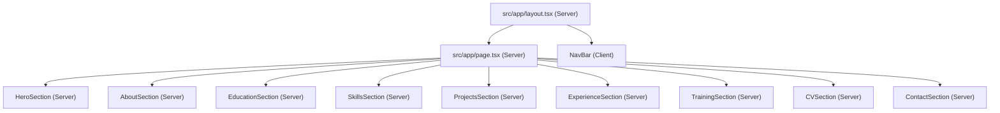

# Design Document: Portfolio Website

## Overview

Tasnem Moura's personal engineering portfolio is a single-page Next.js 16 application built with the App Router and TypeScript in strict mode. It presents her background in Electrical and Computer Engineering — covering VLSI, microelectronics, digital systems, and hardware engineering — to recruiters and hiring managers through a clean, accessible, and fully responsive interface.

The site is structured as one long scrollable page with nine named sections. A sticky navigation bar lets visitors jump to any section instantly. All portfolio data is stored in typed TypeScript files under `src/content/` and flows down into presentation components purely through props; no presentation component ever imports content directly.

The design deliberately avoids external dependencies beyond Next.js itself. Styling relies entirely on CSS Modules and CSS custom properties (design tokens). No Tailwind, no styled-components, no external font services.

---

## Architecture

### High-Level Data Flow

```
src/content/             →   src/app/page.tsx         →   src/components/
(typed data files)            (assembles sections)          (presentation components)

projects.ts    ──────────────────────────────────────────→  ProjectsSection
skills.ts      ──────────────────────────────────────────→  SkillsSection
experience.ts  ──────────────────────────────────────────→  ExperienceSection
education.ts   ──────────────────────────────────────────→  EducationSection
certificates.ts ─────────────────────────────────────────→  TrainingSection
```

`page.tsx` is a React Server Component. It imports from all five content files, applies any ordering transformations (reverse-chronological sort for education and experience), and renders each section component passing data as typed props.

### Component Responsibility Layers

| Layer | Location | Responsibility |
|---|---|---|
| Data | `src/content/*.ts` | Typed data storage; no JSX |
| Page | `src/app/page.tsx` | Imports data, composes page, no styling logic |
| Layout | `src/app/layout.tsx` | `<html>`, `<body>`, metadata, NavBar (shell) |
| Section containers | `src/components/*Section.tsx` | Server Components; receive typed data props, render semantic `<section>` |
| Presentation atoms | `src/components/*.tsx` | Render individual cards, items, links; receive atomic props |
| Client islands | `src/components/NavBar.tsx`, `src/components/HamburgerMenu.tsx` | `"use client"` for IntersectionObserver, scroll, and toggle state |

### "use client" Boundary

Only two components require `"use client"`:

1. **`NavBar`** — needs `useEffect` for `IntersectionObserver`-based active-section tracking and `useState` for the mobile menu open/closed state.
2. **`HamburgerMenu`** — the button and animated icon inside the NavBar that toggles mobile menu state. Can be co-located inside `NavBar.tsx` or extracted as a sub-component.

All other components are Server Components and will be rendered on the server with no client JavaScript bundle impact.

### Page Assembly Diagram



### URL and Scroll Strategy

Each section renders with a matching `id` attribute (e.g., `id="projects"`). Navigation links are `<a href="#projects">` anchors. The NavBar's `useEffect` sets up one `IntersectionObserver` watching all section elements and updates a `activeSection` state string. The active style is applied by comparing each link's href to the active state.

---

## Components and Interfaces

### NavBar

**File:** `src/components/NavBar.tsx`  
**Directive:** `"use client"`

```typescript
// No external props — all data is static nav structure
export function NavBar(): JSX.Element
```

Internal state:
- `isMenuOpen: boolean` — controls mobile hamburger expansion
- `activeSection: string` — updated by IntersectionObserver; matches section `id` values

Nav items are defined as a static constant within the file (not imported from `src/content/`; these are UI navigation labels, not portfolio data):

```typescript
const NAV_ITEMS = [
  { label: 'Home',       href: '#hero'       },
  { label: 'About',      href: '#about'      },
  { label: 'Education',  href: '#education'  },
  { label: 'Skills',     href: '#skills'     },
  { label: 'Projects',   href: '#projects'   },
  { label: 'Experience', href: '#experience' },
  { label: 'Training',   href: '#training'   },
  { label: 'CV',         href: '#cv'         },
  { label: 'Contact',    href: '#contact'    },
] as const;
```

Behaviour:
- On mount, creates an `IntersectionObserver` with `threshold: 0.4` watching all elements matching `section[id]`. When a section enters the viewport above threshold, its `id` becomes `activeSection`.
- On mobile click of a nav link, `setIsMenuOpen(false)`.
- The hamburger button has `aria-expanded={isMenuOpen}` and `aria-controls="nav-links-list"`.

---

### HeroSection

**File:** `src/components/HeroSection.tsx`  
**Directive:** Server Component

```typescript
interface HeroProps {
  name: string;
  title: string;
  tagline: string;          // ≤30 words
  cvPath: string;           // path to CV file e.g. "/resume/TasnemMoura_CV.pdf"
  contactHref: string;      // "#contact"
}

export function HeroSection(props: HeroProps): JSX.Element
```

Renders:
- `<section id="hero" aria-labelledby="hero-heading">`
- `<h1 id="hero-heading">{props.name}</h1>`
- `<p>{props.title}</p>`
- `<p>{props.tagline}</p>`
- `<a href={props.contactHref}>Get in Touch</a>`
- `<a href={props.cvPath} download>Download CV</a>`

---

### AboutSection

**File:** `src/components/AboutSection.tsx`  
**Directive:** Server Component

```typescript
interface AboutProps {
  biography: string;
  profileImage: {
    src: string;
    width: number;
    height: number;
    alt: string;
  };
}

export function AboutSection(props: AboutProps): JSX.Element
```

Renders:
- `<section id="about" aria-labelledby="about-heading">`
- `<h2 id="about-heading">About Me</h2>`
- `<Image>` using `next/image` with all required props
- `<p>{props.biography}</p>`

---

### EducationSection

**File:** `src/components/EducationSection.tsx`  
**Directive:** Server Component

```typescript
interface EducationEntryProps {
  institution: string;
  degree: string;
  fieldOfStudy: string;
  graduationYear: number;
}

interface EducationSectionProps {
  entries: EducationEntryProps[];   // pre-sorted reverse-chronological by page.tsx
}

export function EducationSection(props: EducationSectionProps): JSX.Element
```

Renders:
- `<section id="education" aria-labelledby="education-heading">`
- `<h2 id="education-heading">Education</h2>`
- Maps `props.entries` to `<EducationCard>` atoms

---

### EducationCard

**File:** `src/components/EducationCard.tsx`  
**Directive:** Server Component

```typescript
interface EducationCardProps {
  institution: string;
  degree: string;
  fieldOfStudy: string;
  graduationYear: number;
}

export function EducationCard(props: EducationCardProps): JSX.Element
```

---

### SkillsSection

**File:** `src/components/SkillsSection.tsx`  
**Directive:** Server Component

```typescript
interface SkillCategoryProps {
  name: string;
  skills: string[];
}

interface SkillsSectionProps {
  categories: SkillCategoryProps[];
}

export function SkillsSection(props: SkillsSectionProps): JSX.Element
```

Renders:
- `<section id="skills" aria-labelledby="skills-heading">`
- `<h2 id="skills-heading">Technical Skills</h2>`
- Maps `props.categories` to `<SkillCategory>` atoms

---

### SkillCategory

**File:** `src/components/SkillCategory.tsx`  
**Directive:** Server Component

```typescript
interface SkillCategoryProps {
  name: string;
  skills: string[];
}

export function SkillCategory(props: SkillCategoryProps): JSX.Element
```

Renders category name as `<h3>` and skills as a `<ul>` list.

---

### ProjectsSection

**File:** `src/components/ProjectsSection.tsx`  
**Directive:** Server Component

```typescript
interface ProjectImage {
  src: string;
  width: number;
  height: number;
  alt: string;
}

interface ProjectProps {
  title: string;
  description: string;
  technologies: string[];
  domain: string;
  externalLink?: { href: string; label: string };
  image?: ProjectImage;
}

interface ProjectsSectionProps {
  projects: ProjectProps[];
}

export function ProjectsSection(props: ProjectsSectionProps): JSX.Element
```

Renders:
- `<section id="projects" aria-labelledby="projects-heading">`
- `<h2 id="projects-heading">Projects</h2>`
- Maps `props.projects` to `<ProjectCard>` atoms

---

### ProjectCard

**File:** `src/components/ProjectCard.tsx`  
**Directive:** Server Component

```typescript
// Same shape as ProjectProps above
export function ProjectCard(props: ProjectProps): JSX.Element
```

Conditionally renders `<Image>` if `props.image` is defined. Conditionally renders an `<a>` if `props.externalLink` is defined.

---

### ExperienceSection

**File:** `src/components/ExperienceSection.tsx`  
**Directive:** Server Component

```typescript
interface ExperienceEntryProps {
  jobTitle: string;
  organisation: string;
  period: string;           // e.g. "Jan 2023 – Mar 2024"
  description: string;
}

interface ExperienceSectionProps {
  entries: ExperienceEntryProps[];  // pre-sorted reverse-chronological by page.tsx
}

export function ExperienceSection(props: ExperienceSectionProps): JSX.Element
```

---

### ExperienceCard

**File:** `src/components/ExperienceCard.tsx`  
**Directive:** Server Component

```typescript
interface ExperienceCardProps {
  jobTitle: string;
  organisation: string;
  period: string;
  description: string;
}

export function ExperienceCard(props: ExperienceCardProps): JSX.Element
```

---

### TrainingSection

**File:** `src/components/TrainingSection.tsx`  
**Directive:** Server Component

```typescript
interface CertificateProps {
  name: string;
  issuingOrganisation: string;
  completionDate: string;     // e.g. "2023" or "March 2023"
  credentialUrl?: string;
}

interface TrainingSectionProps {
  certificates: CertificateProps[];
}

export function TrainingSection(props: TrainingSectionProps): JSX.Element
```

---

### CertificateCard

**File:** `src/components/CertificateCard.tsx`  
**Directive:** Server Component

```typescript
interface CertificateCardProps {
  name: string;
  issuingOrganisation: string;
  completionDate: string;
  credentialUrl?: string;
}

export function CertificateCard(props: CertificateCardProps): JSX.Element
```

Conditionally renders `<a href={credentialUrl} rel="noopener noreferrer" target="_blank">Verify Credential</a>` when `credentialUrl` is defined.

---

### CVSection

**File:** `src/components/CVSection.tsx`  
**Directive:** Server Component

```typescript
interface CVSectionProps {
  cvPath: string;
}

export function CVSection(props: CVSectionProps): JSX.Element
```

Renders:
- `<section id="cv" aria-labelledby="cv-heading">`
- `<h2 id="cv-heading">CV</h2>`
- Brief prompt paragraph
- `<a href={props.cvPath} download aria-label="Download Tasnem Moura's CV">Download CV</a>`

---

### ContactSection

**File:** `src/components/ContactSection.tsx`  
**Directive:** Server Component

```typescript
interface ContactSectionProps {
  linkedInUrl: string;
  githubUrl: string;
  email: string;
}

export function ContactSection(props: ContactSectionProps): JSX.Element
```

Renders:
- `<section id="contact" aria-labelledby="contact-heading">`
- `<h2 id="contact-heading">Contact</h2>`
- `<a href={linkedInUrl} target="_blank" rel="noopener noreferrer" aria-label="Visit Tasnem Moura's LinkedIn profile">LinkedIn</a>`
- `<a href={githubUrl} target="_blank" rel="noopener noreferrer" aria-label="Visit Tasnem Moura's GitHub profile">GitHub</a>`
- `<a href={`mailto:${email}`} aria-label="Send Tasnem an email">{email}</a>`

---

## Data Models

### `src/content/education.ts`

```typescript
export interface EducationEntry {
  id: string;
  institution: string;
  degree: string;
  fieldOfStudy: string;
  graduationYear: number;
}

export const education: EducationEntry[] = [
  // entries — page.tsx will sort these reverse-chronologically
];
```

---

### `src/content/skills.ts`

```typescript
export interface SkillCategory {
  id: string;
  name: string;
  skills: string[];
}

export const skills: SkillCategory[] = [
  { id: 'hardware-vlsi',      name: 'Hardware & VLSI',          skills: [...] },
  { id: 'programming',        name: 'Programming Languages',     skills: [...] },
  { id: 'tools-software',     name: 'Tools & Software',          skills: [...] },
  { id: 'ai-ml',              name: 'AI & Machine Learning',     skills: [...] },
];
```

---

### `src/content/projects.ts`

```typescript
export interface ProjectImage {
  src: string;
  width: number;
  height: number;
  alt: string;
}

export interface ExternalLink {
  href: string;
  label: string;
}

export interface Project {
  id: string;
  title: string;
  description: string;
  technologies: string[];
  domain: string;
  externalLink?: ExternalLink;
  image?: ProjectImage;
}

export const projects: Project[] = [
  {
    id: 'adc-two-step',
    title: 'Two-Step Time-Domain ADC',
    description: '...',
    technologies: [...],
    domain: 'Analogue IC Design / VLSI',
  },
  {
    id: 'mems-optical',
    title: 'MEMS-Based Optical System',
    description: '...',
    technologies: [...],
    domain: 'MEMS / Optical Systems',
  },
];
```

---

### `src/content/experience.ts`

```typescript
export interface ExperienceEntry {
  id: string;
  jobTitle: string;
  organisation: string;
  startYear: number;
  startMonth: number;   // 1–12
  endYear?: number;     // undefined = current
  endMonth?: number;
  period: string;       // human-readable, e.g. "Jan 2023 – Present"
  description: string;
}

export const experience: ExperienceEntry[] = [
  // entries — page.tsx will sort by startYear desc, startMonth desc
];
```

The `period` string is denormalised for display convenience. The `startYear`/`startMonth` fields are used for sorting in `page.tsx`.

---

### `src/content/certificates.ts`

```typescript
export interface Certificate {
  id: string;
  name: string;
  issuingOrganisation: string;
  completionDate: string;    // display string, e.g. "2023" or "March 2023"
  completionYear: number;    // numeric year for optional future sorting
  credentialUrl?: string;
}

export const certificates: Certificate[] = [
  // VLSI-related, NVIDIA, and AI entries required by Requirement 9.3
];
```

---

### `src/content/about.ts`

A small auxiliary content file for biography and profile image data, keeping it out of `page.tsx` literal values:

```typescript
export interface AboutContent {
  biography: string;
  profileImage: {
    src: string;
    width: number;
    height: number;
    alt: string;
  };
}

export const about: AboutContent = {
  biography: '...',
  profileImage: {
    src: '/images/profile.jpg',
    width: 400,
    height: 400,
    alt: 'Portrait of Tasnem Moura, Electrical and Computer Engineer',
  },
};
```

---

### `src/content/hero.ts`

```typescript
export interface HeroContent {
  name: string;
  title: string;
  tagline: string;   // ≤30 words
  cvPath: string;
}

export const hero: HeroContent = {
  name: 'Tasnem Moura',
  title: 'Electrical & Computer Engineer',
  tagline: 'Specialising in VLSI, microelectronics, digital systems, and hardware engineering.',
  cvPath: '/resume/TasnemMoura_CV.pdf',
};
```

---

### `src/content/contact.ts`

```typescript
export interface ContactContent {
  linkedInUrl: string;
  githubUrl: string;
  email: string;
}

export const contact: ContactContent = {
  linkedInUrl: 'https://www.linkedin.com/in/...',
  githubUrl:   'https://github.com/...',
  email:       'tasnem@example.com',
};
```

---

## Design Tokens

All tokens are CSS custom properties defined at `:root` in `src/app/globals.css`.

### Colour Palette

```css
:root {
  /* Neutrals */
  --color-background:      #0f1117;   /* deep navy-black */
  --color-surface:         #1a1d2e;   /* card / section background */
  --color-surface-raised:  #222640;   /* elevated card */
  --color-border:          #2e3354;

  /* Text */
  --color-text-primary:    #e8eaf6;   /* high-contrast body text */
  --color-text-secondary:  #9fa8da;   /* subdued labels */
  --color-text-muted:      #6272a4;   /* timestamps, metadata */

  /* Accent */
  --color-accent:          #7986cb;   /* indigo — links, active states */
  --color-accent-hover:    #9fa8da;
  --color-accent-fg:       #0f1117;   /* text on accent backgrounds */

  /* Semantic */
  --color-error:           #ef5350;
  --color-success:         #66bb6a;
}
```

Contrast check:
- `--color-text-primary` (#e8eaf6) on `--color-background` (#0f1117): ≈14:1 ✓ (WCAG AA / AAA)
- `--color-text-secondary` (#9fa8da) on `--color-background`: ≈6:1 ✓
- `--color-text-muted` (#6272a4) on `--color-background`: ≈4.6:1 ✓ (just above 4.5:1 AA threshold)
- `--color-accent` (#7986cb) on `--color-background`: ≈5.1:1 ✓

### Typography

```css
:root {
  --font-family-base: system-ui, -apple-system, BlinkMacSystemFont,
                      'Segoe UI', Roboto, Helvetica, Arial, sans-serif;

  /* Scale (rem) */
  --font-size-xs:   0.75rem;   /*  12px */
  --font-size-sm:   0.875rem;  /*  14px */
  --font-size-base: 1rem;      /*  16px */
  --font-size-lg:   1.125rem;  /*  18px */
  --font-size-xl:   1.25rem;   /*  20px */
  --font-size-2xl:  1.5rem;    /*  24px */
  --font-size-3xl:  1.875rem;  /*  30px */
  --font-size-4xl:  2.25rem;   /*  36px */
  --font-size-5xl:  3rem;      /*  48px */

  /* Weight */
  --font-weight-normal:    400;
  --font-weight-medium:    500;
  --font-weight-semibold:  600;
  --font-weight-bold:      700;

  /* Line height */
  --line-height-tight:    1.2;
  --line-height-snug:     1.4;
  --line-height-normal:   1.6;
  --line-height-relaxed:  1.75;
}
```

### Spacing

```css
:root {
  --space-1:   0.25rem;   /*  4px */
  --space-2:   0.5rem;    /*  8px */
  --space-3:   0.75rem;   /* 12px */
  --space-4:   1rem;      /* 16px */
  --space-5:   1.25rem;   /* 20px */
  --space-6:   1.5rem;    /* 24px */
  --space-8:   2rem;      /* 32px */
  --space-10:  2.5rem;    /* 40px */
  --space-12:  3rem;      /* 48px */
  --space-16:  4rem;      /* 64px */
  --space-20:  5rem;      /* 80px */
  --space-24:  6rem;      /* 96px */

  --section-padding-y:   var(--space-16);
  --section-padding-x:   var(--space-6);
  --container-max-width: 1100px;
  --navbar-height:       4rem;   /* 64px */
}
```

### Breakpoints

```css
:root {
  /* Used in @media queries — cannot be CSS custom properties,
     so define as comments here and use the literal values in media queries */
  /* --breakpoint-sm:  480px  */
  /* --breakpoint-md:  768px  */
  /* --breakpoint-lg:  1024px */
  /* --breakpoint-xl:  1280px */
}
```

Media queries in module CSS files:
```css
/* Mobile first: base styles apply to all widths */
/* Medium and up */
@media (min-width: 768px)  { ... }
/* Large and up */
@media (min-width: 1024px) { ... }
```

### Border Radius and Misc

```css
:root {
  --radius-sm:  0.25rem;
  --radius-md:  0.5rem;
  --radius-lg:  1rem;
  --radius-full: 9999px;

  --transition-fast:    150ms ease;
  --transition-normal:  250ms ease;

  --shadow-card: 0 2px 8px rgba(0, 0, 0, 0.4);
  --shadow-raised: 0 4px 16px rgba(0, 0, 0, 0.6);

  /* Minimum touch target size per WCAG 2.5.5 */
  --min-touch-target: 44px;
}
```

---

## Page Layout and Section Structure

`src/app/page.tsx` assembles the page in this order:

```
<main>
  <HeroSection id="hero" />
  <AboutSection id="about" />
  <EducationSection id="education" />
  <SkillsSection id="skills" />
  <ProjectsSection id="projects" />
  <ExperienceSection id="experience" />
  <TrainingSection id="training" />
  <CVSection id="cv" />
  <ContactSection id="contact" />
</main>
```

`src/app/layout.tsx` wraps this with:

```
<html lang="en">
  <body>
    <NavBar />
    {children}         ← page.tsx main content
    <footer>           ← copyright / brief credits
  </body>
</html>
```

### Section Scroll Offset

Each section must account for the sticky navbar height when scrolled to. This is achieved with a CSS utility applied to every `<section>`:

```css
/* globals.css */
section[id] {
  scroll-margin-top: var(--navbar-height);
}
```

### Reverse-Chronological Sorting

`page.tsx` sorts education and experience data before passing to components:

```typescript
// Education: sort by graduationYear descending
const sortedEducation = [...education].sort((a, b) => b.graduationYear - a.graduationYear);

// Experience: sort by startYear desc, then startMonth desc
const sortedExperience = [...experience].sort((a, b) =>
  b.startYear !== a.startYear
    ? b.startYear - a.startYear
    : b.startMonth - a.startMonth
);
```

Sorting is the responsibility of `page.tsx`, not the section components. Section components render whatever order they receive. This keeps presentation components pure and independently testable.

---

## Correctness Properties

*A property is a characteristic or behavior that should hold true across all valid executions of a system — essentially, a formal statement about what the system should do. Properties serve as the bridge between human-readable specifications and machine-verifiable correctness guarantees.*

---

### Correctness Property Analysis

Before listing properties, the following consolidations were made after reviewing all PBT-applicable criteria:

- Requirements 5.1 (all education entries rendered), 6.1 (all skills rendered), 7.1 (all projects rendered), 8.1 (all experience entries rendered), 9.1 (all certificates rendered) all express the same invariant — "for any array of items, all items appear in the rendered output" — for different data types. These are consolidated into **Property 1** (data completeness).

- Requirements 5.2 (education fields), 6.2/6.3 (skills category + list), 7.2 (project fields), 8.2 (experience fields), 9.2 (certificate fields) all express "for any item, all required fields appear in the rendered output." These are consolidated into **Property 2** (required fields rendered).

- Requirements 5.3 (education ordering) and 8.3 (experience ordering) both express reverse-chronological ordering. These are consolidated into **Property 3** (reverse-chronological ordering).

- Requirements 7.5 (project external link), 7.6 (project image), and 9.4 (certificate credential link) all express "if an optional field is present, it appears in the rendered output." These are consolidated into **Property 4** (conditional element rendering).

- Requirements 4.4, 5.4, 6.4, 7.7, 8.4, 9.5, and 10.4 all require a visible section heading. Consolidated into **Property 5** (section heading presence).

- Requirement 12.3 (aria-labelledby on sections) applies universally to all section components. **Property 6**.

- Requirement 2.9 (active nav link exclusivity) is a standalone property. **Property 7**.

- Requirement 3.3 (tagline word count) is a data constraint on the hero content. **Property 8**.

- Requirement 4.1 (biography rendered from props) is captured by **Property 2** (all required fields rendered) and **Property 1** (data completeness).

---

### Property 1: Data Completeness

*For any* array of typed content items (education entries, skill categories, projects, experience entries, or certificates), every item in the input array must produce a corresponding rendered element in the component's output. No item may be silently dropped.

**Validates: Requirements 5.1, 6.1, 7.1, 8.1, 9.1**

---

### Property 2: Required Fields Rendered

*For any* valid content item passed as a prop to a section component, every required field of that item must be present as visible text in the rendered output. For education entries: institution, degree, fieldOfStudy, and graduationYear. For skill categories: category name and all skill names. For projects: title, description, technologies, and domain. For experience entries: jobTitle, organisation, period, and description. For certificates: name, issuingOrganisation, and completionDate. For the About section: the biography text passed as a prop.

**Validates: Requirements 4.1, 5.2, 6.2, 6.3, 7.2, 8.2, 9.2**

---

### Property 3: Reverse-Chronological Ordering

*For any* array of education entries or experience entries, when sorted by the `page.tsx` sorting function, the resulting order must be descending by year (and by month for experience entries within the same year). Formally: for any two adjacent items `a` and `b` in the sorted output, `a.graduationYear ≥ b.graduationYear` (education) or `(a.startYear, a.startMonth) ≥ (b.startYear, b.startMonth)` lexicographically (experience).

**Validates: Requirements 5.3, 8.3**

---

### Property 4: Conditional Element Rendering

*For any* project item with a defined `externalLink` field, the rendered `ProjectCard` must contain an anchor element with `href` equal to `externalLink.href`. *For any* project item with a defined `image` field, the rendered `ProjectCard` must contain an image element. *For any* certificate with a defined `credentialUrl`, the rendered `CertificateCard` must contain an anchor element with `href` equal to `credentialUrl`. Conversely, *for any* item where these optional fields are `undefined`, no such anchor or image element should be rendered.

**Validates: Requirements 7.5, 7.6, 9.4**

---

### Property 5: Section Heading Presence

*For any* section component rendered with valid props, the rendered HTML must contain exactly one heading element (`h2`) with a non-empty text content that serves as the section's visible label.

**Validates: Requirements 4.4, 5.4, 6.4, 7.7, 8.4, 9.5, 10.4**

---

### Property 6: Section Accessibility Label

*For any* section component rendered with valid props, the root `<section>` element must have an `aria-labelledby` attribute whose value matches the `id` of the heading element within that section.

**Validates: Requirements 12.3**

---

### Property 7: Active Navigation Link Exclusivity

*For any* navigation state where exactly one section ID is marked as active, the NavBar renders exactly one navigation link with the active CSS class applied, and that link's `href` matches `#<activeSection>`. All other navigation links must not have the active class.

**Validates: Requirements 2.9**

---

### Property 8: Tagline Word Count

*For any* tagline string stored in `src/content/hero.ts`, the word count (defined as the number of whitespace-separated tokens after trimming) must be less than or equal to 30.

**Validates: Requirements 3.3**

---

## Error Handling

### Missing or Undefined Content Fields

All data types use non-optional TypeScript fields for required data and explicit `?` for optional fields (e.g., `externalLink?`, `image?`, `credentialUrl?`). With TypeScript strict mode and `tsc --noEmit`, missing required fields are caught at compile time — no runtime error handling needed for structural content issues.

### Optional Field Guards

Components that render optional fields use conditional JSX:
```typescript
{props.externalLink && (
  <a href={props.externalLink.href} ... >{props.externalLink.label}</a>
)}
```

TypeScript's strict null checks ensure these guards are not forgotten.

### Image Loading Errors

`next/image` handles loading errors internally. If a profile or project image fails to load, the `alt` text is displayed. All `alt` attributes are required (non-optional in the props interface), so no image will ever render without accessible fallback text.

### CV File Missing

The CV download link uses a static `<a download>` anchor. If the file does not exist at `public/resume/`, the browser will report a 404. This is a deployment concern, not a runtime error in the application code. The design notes that the CV file must be placed at `public/resume/TasnemMoura_CV.pdf` before deployment.

### Navigation IntersectionObserver Unavailability

`IntersectionObserver` is available in all modern browsers. The NavBar's `useEffect` only runs on the client after hydration, so server rendering is unaffected. If an extremely old browser does not support IntersectionObserver, the NavBar renders without active-link tracking but remains fully functional for navigation.

### Hydration Mismatches

Because the NavBar is the only client component and its initial state (`isMenuOpen: false`, `activeSection: ''`) is deterministic, hydration mismatches should not occur. The server renders the NavBar in its closed, no-active-section state; the client hydrates to the same initial state before `useEffect` runs.

---

## Testing Strategy

### Assessment: Is Property-Based Testing Appropriate?

This feature is a presentational portfolio website. The bulk of the codebase consists of React components that render typed data objects as HTML. Most components have clear input/output behaviour: given a typed props object, produce a specific HTML structure. This makes the data-rendering components well-suited for property-based testing.

However, the following aspects are **not** suitable for PBT and should use example-based or smoke tests:
- CSS layout and responsiveness — requires a rendering engine
- WCAG colour contrast — requires pixel-level analysis
- Sticky navbar positioning — CSS behaviour
- Next.js build configuration (metadata, lang attribute, file structure)
- Accessibility tree (aria roles, keyboard focus) — example-based with @testing-library/react

**PBT library:** [fast-check](https://fast-check.io/) (TypeScript-native, actively maintained)  
**Test runner:** [Vitest](https://vitest.dev/) (fast, zero-config with Vite/Next.js, TypeScript-first)

### Unit and Property Test Structure

```
src/
  __tests__/
    content/
      hero.test.ts              — Property 8: tagline word count
    components/
      EducationSection.test.tsx — Properties 1, 2, 3, 5, 6
      SkillsSection.test.tsx    — Properties 1, 2, 5, 6
      ProjectsSection.test.tsx  — Properties 1, 2, 4, 5, 6
      ExperienceSection.test.tsx — Properties 1, 2, 3, 5, 6
      TrainingSection.test.tsx  — Properties 1, 2, 4, 5, 6
      AboutSection.test.tsx     — Properties 2, 5, 6
      NavBar.test.tsx            — Property 7, example-based tests for 2.1–2.8
      CVSection.test.tsx         — example-based tests for 10.1–10.5
      ContactSection.test.tsx    — example-based tests for 11.1–11.7
    sorting/
      sort.test.ts              — Property 3: reverse-chronological sort
```

### Property Test Configuration

Each property test runs a minimum of **100 iterations** via fast-check's `fc.assert(fc.property(...))`.

Tag format applied as a comment above each property test:
```typescript
// Feature: portfolio-website, Property 1: data completeness — all items rendered
```

### Property Test Examples

```typescript
// Feature: portfolio-website, Property 1: data completeness — all items rendered
// Feature: portfolio-website, Property 2: required fields rendered
// Feature: portfolio-website, Property 3: reverse-chronological ordering
it('renders all education entries in reverse-chronological order', () => {
  fc.assert(
    fc.property(
      fc.array(arbitraryEducationEntry(), { minLength: 1, maxLength: 20 }),
      (entries) => {
        const sorted = sortEducation(entries);
        const { getAllByRole } = render(<EducationSection entries={sorted} />);
        // Property 1: all entries present
        entries.forEach(e => expect(screen.getByText(e.institution)).toBeInTheDocument());
        // Property 2: all fields rendered
        entries.forEach(e => {
          expect(screen.getByText(e.degree)).toBeInTheDocument();
          expect(screen.getByText(e.fieldOfStudy)).toBeInTheDocument();
          expect(screen.getByText(String(e.graduationYear))).toBeInTheDocument();
        });
        // Property 3: order is descending by graduationYear
        for (let i = 0; i < sorted.length - 1; i++) {
          expect(sorted[i].graduationYear).toBeGreaterThanOrEqual(sorted[i + 1].graduationYear);
        }
      }
    ),
    { numRuns: 100 }
  );
});
```

### Example-Based Tests

Example-based tests cover:
- NavBar renders exactly nine nav links with correct labels (Requirement 2.2)
- NavBar mobile hamburger appears below 768px (Requirement 2.7)
- Hero `<h1>` contains "Tasnem Moura" (Requirement 3.1)
- Hero Download CV link has `download` attribute (Requirement 3.5)
- About section contains `` with non-empty alt (Requirement 4.2)
- Contact section LinkedIn/GitHub links have `target="_blank"` and `rel="noopener noreferrer"` (Requirements 11.4, 11.6)
- CV download link has descriptive `aria-label` (Requirement 10.5)
- Root layout contains `<html lang="en">`, `<title>`, and `<meta name="description">` (Requirements 14.3, 14.4)

### Smoke / Linting Checks

These are verified by the build pipeline, not test files:
- `npm run lint` passes with zero errors (Requirement 14.1)
- `tsc --noEmit` passes with zero TypeScript errors (Requirement 1.2)
- `next build` succeeds without warnings about missing image dimensions

### Accessibility Testing

- Run `@axe-core/react` (via `jest-axe` or `vitest-axe`) against rendered section components to catch automated WCAG violations.
- Manual keyboard navigation testing is required for full WCAG 2.1 AA compliance verification, particularly for the mobile hamburger menu and nav link focus order.
- Full validation requires manual testing with assistive technologies and expert accessibility review.
